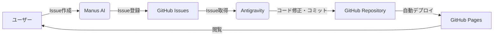

# Mind-Upload
<!-- IMPORTANT: Do not delete or overwrite this information. It serves as the project's permanent knowledge base. -->

マインドアップロード実現のための中核となるコアサイト。

## 目的

このサイトは、マインドアップロードの実現に向けた技術・研究・コミュニティの中心的ハブとなることを目指しています。

ここでいうマインドアップロードとは、**意識や記憶の交換・複製を可能とする技術**を指します。

## 今後の展望

本プロジェクトは、最終的にサイトの更新や運用プロセスを完全に自動化することを目指しています。現在は手動で行っているタスクも、順次自動化ツールやCI/CDパイプラインへ移行する予定です。

## 貢献方法

- [issue.md](issue.md) を参照
- [Issueを立てる](https://github.com/yasufumi-nakata/mind-upload/issues)

## 公開コンテンツ統合ポリシー

- 公開ページの統合先は [content_hub.md](content_hub.md) で一元管理します。
- 新規ファイルを作成する前に、既存ページ（`verification.md` / `tech_roadmap.md` / `perspective.md` / `research_harvest_50.md` / `issue.md`）へ統合可能かを確認します。
- 中間成果・作業ログ・自動生成物は原則 `automation/` または `ignore/` で管理し、公開導線は `index.md` と `content_hub.md` に集約します。

## GitHub Wiki 運用

- 学習用の wiki 本体は GitHub Wiki を前提にします。
- リポジトリ内の `wiki/` は GitHub Wiki 用ソースとして扱い、サイト内の学習ページ編集もここで行います。
- GitHub Wiki 用の出力は `github-wiki-export/` に生成します。
- 生成は `scripts/export_github_wiki.rb`、反映は `scripts/publish_github_wiki.sh` を使います。
- GitHub Wiki の git リポジトリは、GitHub の Web UI で最初の Wiki ページを 1 つ作成した後でないと clone / push できません。その初期化後に `scripts/publish_github_wiki.sh` を実行してください。
- `.github/workflows/sync-github-wiki.yml` も追加してあり、初期化後は `main` への push で GitHub Wiki への同期を自動実行できます。
- GitHub Actions の既定トークンで不足する場合は、`GH_WIKI_TOKEN` シークレットに `repo` 権限のトークンを設定してください。

## LLM向けプロンプトの利用

- LLMに調査や分析を依頼する際の科学者スタイルのプロンプト例は [.agent/agent.md](.agent/agent.md) にまとめています。
- AI運用時は、実行可能な作業だけを提案・実施する「握れるボール原則」を必ず遵守してください（[.agent/agent.md](.agent/agent.md) の該当節）。

## リンク

- **GitHub**: https://github.com/yasufumi-nakata/mind-upload

## システム構成 (System Architecture)

本プロジェクトでは、AIエージェントを活用した半自動的なコンテンツ更新ワークフローを採用しています。

### ワークフロー

1.  **Issue作成 (Manus)**: ユーザーがManus AIに対して改善提案や新機能のリクエストを伝えると、ManusがGitHub Issueを自動作成します。
2.  **Issue処理 (Antigravity)**: Antigravity（本エージェント）がオープンなIssueを取得し、コードベースを分析・修正し、コミット＆プッシュを行います。コミットメッセージに `Fixes #N` を含めることで、Issueは自動的にクローズされます。
3.  **デプロイ (GitHub Pages)**: `main` ブランチへのプッシュをトリガーに、GitHub Pagesが自動的にサイトを更新します。

## ホスティング

- GitHub Pages
