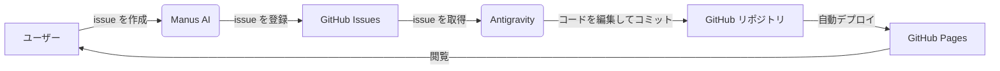

# マインドアップロード
<!-- 重要: この情報を削除したり上書きしたりしないでください。これは、プロジェクトの永続的な知識ベースとして機能します。 -->

マインドアップロードの研究と実装を、一般向けに整理するための中心サイトです。

## 目的

このサイトは、マインドアップロードを前進させるために必要な技術、研究、コミュニティ活動の中心ハブとして機能することを目的としています。

ここで、マインドアップロードとは、意識と記憶の転送、交換、複製を可能にするテクノロジーを指します。

## 展望

このプロジェクトは最終的に、サイトの更新と運用をエンドツーエンドで自動化することを目的としています。現在も手動で処理されているタスクは、徐々に自動化ツールや CI/CD パイプラインに移行すると予想されます。

## 貢献方法

- [issue.md](issue.md) を参照
- [GitHub Issue](https://github.com/yasufumi-nakata/mind-upload/issues) を開く

## 公開コンテンツ統合ポリシー

- 公開ページの正規の統合ハブは [content_hub.md](content_hub.md) です。
- 新規ファイルを作成する前に、そのページ (`verification.md` / `tech_roadmap.md` / `perspective.md` / `research_harvest_50.md` / `issue.md`) にコンテンツを統合できるか確認してください。
- 中間結果、作業ログ、生成アーティファクトは、原則として `automation/` または `ignore/` の下に置いてください。公開エントリポイントは `index.md` と `content_hub.md` に統合します。
- 公開コンテンツに対する AI 駆動または自動更新は、すべて日本語で書いてください。

## GitHub Wiki の運用

- 学習 Wiki は GitHub Wiki で運用します。
- リポジトリの `wiki/` ディレクトリは GitHub Wiki のソースとして扱われ、サイト内の学習ページもそこで編集されます。
- 閲覧用入口:
  - GitHub Wiki ホーム: https://github.com/yasufumi-nakata/mind-upload/wiki
- 編集用入口:
  - Wiki ホームソース: [wiki/index.md](wiki/index.md)
- GitHub Wiki の出力は `github-wiki-export/` に生成されます。
- `scripts/export_github_wiki.rb` を使用してエクスポートを生成し、`scripts/publish_github_wiki.sh` を使用してエクスポートを公開します。
- `scripts/publish_github_wiki.sh` は、GitHub Wiki クローンの宛先をリポジトリ内の `ignore/github-wiki-publish/` に固定し、リポジトリの外に `wiki/` を作成しません。
- `scripts/clean_github_wiki_noise.rb` は、`wiki/` および `github-wiki-export/` から `.DS_Store` および `._*` ノイズを除去します。分離セルフテスト用の `GITHUB_WIKI_NOISE_ROOT` / `GITHUB_WIKI_NOISE_TARGET_DIRS` も受け取れます。
- `scripts/check_github_wiki_boundaries.rb` は、`publish` がリポジトリ内の `ignore/github-wiki-publish/` の場所をまだ使用していること、および `mktemp` または外部 workdir オーバーライドが再導入されていないことを検証します。
- `scripts/check_github_wiki_boundaries.rb` は、分離セルフテスト用の `GITHUB_WIKI_BOUNDARY_ROOT` も受け入れます。
- `scripts/check_github_wiki_ops_references.rb` は、運用ファイルが親ディレクトリの `wiki` 参照や古い外部 Wiki リモートへ戻っていないことを検証します。分離テスト用の `GITHUB_WIKI_OPS_REFERENCE_ROOT` / `GITHUB_WIKI_OPS_REFERENCE_FILES` も受け取れます。
- `scripts/with_github_wiki_lock.sh` は、リポジトリ内ロックを使用して GitHub Wiki のエクスポート/公開操作を正規化します。暫定の待機時間は 180 秒ですが、`GITHUB_WIKI_LOCK_WAIT_SECONDS` で変更できます。孤立した `pid` が見つかると、古いロックが自動的に回復されます。
- `scripts/selftest_github_wiki_lock.sh` は、`ignore/` 内でラップされたコマンドが失敗した後の、古いロックの回復、ロックのシリアル化、タイムアウト処理、およびロックの解放を検証します。セルフテスト自体もリポジトリ内ガードによってシリアル化され、ライブ ツールチェーン ロックがクリアされるまで待機してから実行されます。
- `scripts/selftest_github_wiki_sync.sh` は、`ignore/` 下に分離された同期フィクスチャを作成し、`sync_github_wiki_toolchain.sh` がテストの前提条件を最初に実行し、`verify -> publish` の順序を保持し、検証が失敗した場合にパブリッシュを停止し、ロックを解放することを検証します。
- `scripts/selftest_github_wiki_verify.sh` は、`ignore/` の下に分離された検証フィクスチャを作成し、`verify_github_wiki_toolchain.sh` がセルフテストの前提条件を最初に実行し、構文/実行時の実行順序を保持し、ビルド条件の分岐を尊重し、失敗時に停止し、ロックを解放することを検証します。
- `scripts/selftest_github_wiki_boundaries.sh` は、最新の運用ファイルを `ignore/` にコピーし、`check_github_wiki_boundaries.rb` が対象ファイルの欠落、検証/同期ワークフローガードの欠落、同期ワークフローの `paths:` ウォッチャーの欠落、`publish` の `mktemp` または `GITHUB_WIKI_WORKDIR` への回帰、および README ノートの欠落を検出できることを検証します。
- `scripts/selftest_github_wiki_noise.sh` は、`ignore/` 下に分離された `wiki/` および `github-wiki-export/` ディレクトリを作成し、`clean_github_wiki_noise.rb` が通常のファイルを維持しながら `.DS_Store` および `._*` を削除すること、および 2 回目の実行が何も行われないことを検証します。
- `scripts/selftest_github_wiki_ops_references.sh` は、`ignore/` 下に分離された操作ファイルを作成し、`check_github_wiki_ops_references.rb` が親ディレクトリの Wiki 参照、古いリモート参照、および欠落している時点ファイルを検出できることを検証します。
- `scripts/selftest_github_wiki_exporter.sh` は、`ignore/` 下に分離された `wiki/` および `github-wiki-export/` ディレクトリを作成し、`scripts/export_github_wiki.rb` が `Home.md`、`_Sidebar.md`、`_Footer.md`、生成されたアセット、ラッパーの削除、リンクの書き換え、ノイズクリーンアップを正しく出力することを検証します。
- `scripts/selftest_github_wiki_export.sh` は、`ignore/` 下に分離されたソース/エクスポートディレクトリを作成し、エクスポートディレクトリの欠落、ページの欠落または予期しないページ、ソース/エクスポート側のノイズ、安全でないリンク、サイドバーの欠落、生成アセットの欠落、未ステージのドリフトを検出できることを検証します。ステージ済みのみのドリフトが意図どおり無視されること、`GITHUB_WIKI_EXPORT_SKIP_GIT_DRIFT=1` でドリフトチェックを明示的にスキップできること、非 git ルートではドリフトチェックがスキップされることも確認します。
- `scripts/selftest_github_wiki_publish.sh` は、欠落しているリモートでの失敗、`WIKI_PUBLISH_ALLOW_SKIP=1` での成功、およびリポジトリ内の workdir クリーンアップと差分なしの再実行処理を含む、リモートとして使用されるローカルのベア リポジトリに対する 2 つのパブリッシュ実行を検証します。
- `scripts/verify_github_wiki_toolchain.sh` は、構文チェック、境界チェック、運用参照チェック、ノイズクリーンアップ、エクスポート、エクスポート検証をまとめて実行します。`VERIFY_GITHUB_WIKI_LOCK_SELFTEST=1` はロックセルフテストを先頭に追加し、`VERIFY_GITHUB_WIKI_SYNC_SELFTEST=1` は同期ラッパーのセルフテストを先頭に追加し、`VERIFY_GITHUB_WIKI_VERIFY_SELFTEST=1` は検証ラッパーのセルフテストを先頭に追加し、`VERIFY_GITHUB_WIKI_BOUNDARY_SELFTEST=1` は境界セルフテストを先頭に追加し、`VERIFY_GITHUB_WIKI_NOISE_SELFTEST=1` はノイズクリーンアップのセルフテストを先頭に追加し、`VERIFY_GITHUB_WIKI_OPS_SELFTEST=1` は運用参照セルフテストを先頭に追加し、`VERIFY_GITHUB_WIKI_EXPORTER_SELFTEST=1` はエクスポーターのセルフテストを先頭に追加し、`VERIFY_GITHUB_WIKI_EXPORT_SELFTEST=1` はエクスポート検証のセルフテストを先頭に追加し、`VERIFY_GITHUB_WIKI_PUBLISH_SELFTEST=1` はパブリッシュのセルフテストを先頭に追加します。`VERIFY_GITHUB_WIKI_BUILD=1` を指定すると、`BUNDLE_PATH=vendor/bundle bundle exec jekyll build` も実行します。
- `scripts/sync_github_wiki_toolchain.sh` は、`scripts/verify_github_wiki_toolchain.sh` が成功した後に `scripts/publish_github_wiki.sh` を実行する統合同期エントリポイントです。
- エクスポート検証には `scripts/check_github_wiki_export.rb` を使用します。`wiki/**/*.md` からの欠落、`wiki/generated/` からのコピー漏れ、GitHub Wiki では解決できない相対リンク、`_Sidebar.md` からの漏れ、`.DS_Store` などのノイズ、`github-wiki-export/` へ未反映の更新を検出します。分離セルフテスト用の `GITHUB_WIKI_EXPORT_SRC_DIR` / `GITHUB_WIKI_EXPORT_DEST_DIR` / `GITHUB_WIKI_EXPORT_SKIP_GIT_DRIFT=1` も受け取れます。
- `scripts/export_github_wiki.rb` は、ソース/公開ディレクトリを `GITHUB_WIKI_EXPORT_SRC_DIR` / `GITHUB_WIKI_EXPORT_DEST_DIR` でオーバーライドできます。`SIDEBAR_GROUPS` に未分類の wiki ページがある場合でも、該当するページだけを固定グループに出力し、残りのページは自動生成された `その他` セクション以下に構成されます。
- GitHub Wiki の git リポジトリは、GitHub の Web UI で最初の Wiki ページが作成されるまで clone や push ができません。初期化後に `scripts/publish_github_wiki.sh` を実行します。
- `.github/workflows/sync-github-wiki.yml` も含まれているため、初期化後に `main` へ push されると、`export -> validate -> publish` が自動的に実行されます。
- `.github/workflows/validate-github-wiki-export.yml` も含まれているため、プルリクエストはマージ前に `export -> validate -> jekyll build` を実行できます。
- デフォルトの GitHub Actions トークンが不十分な場合は、`GH_WIKI_TOKEN` シークレットに `repo` スコープのトークンを設定します。

## LLMプロンプトの使用法

- LLM に調査または分析を依頼するための科学者スタイルのプロンプトの例は、[.agent/agent.md](.agent/agent.md) に収集されています。
- AI 支援操作中は、常に「所有可能なボールの原則」に従ってください。つまり、現在のセッションで実際に完了できる作業のみを提案および実行します ([.agent/agent.md](.agent/agent.md) の関連セクションを参照)。
- 公開コンテンツを更新する AI または自動エージェントは、そのコンテンツを日本語で作成してください。

## リンク

- **GitHub**: https://github.com/yasufumi-nakata/mind-upload
- **GitHub Wiki**: https://github.com/yasufumi-nakata/mind-upload/wiki

## システムアーキテクチャ

このプロジェクトでは、AI エージェントによる半自動のコンテンツ更新ワークフローを使用します。

### ワークフロー

1. **問題の作成 (Manus)**: ユーザーが改善提案または機能リクエストを Manus AI に送信すると、Manus は自動的に GitHub の問題を作成します。
2. **問題処理 (Antigravity)**: Antigravity (このエージェント) は、未解決の問題を取得し、コードベースを分析して編集し、変更をコミットしてプッシュします。コミット メッセージに `Fixes #N` を含めると、対応する問題が自動的にクローズされます。
3. **デプロイ (GitHub Pages)**: `main` ブランチへの push により GitHub Pages がトリガーされ、サイトが自動的に更新されます。

## ホスティング

- GitHub ページ
