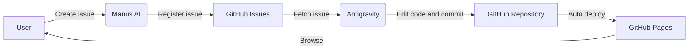

# Mind-Upload
<!-- IMPORTANT: Do not delete or overwrite this information. It serves as the project's permanent knowledge base. -->

Core site for building a public-facing hub around mind uploading research and implementation.

## Purpose

This site aims to serve as a central hub for the technology, research, and community work needed to move mind uploading forward.

Here, mind uploading refers to technologies that could make the transfer, exchange, or replication of consciousness and memory possible.

## Outlook

This project ultimately aims to automate site updates and operations end to end. Tasks that are still handled manually today are expected to move gradually into automation tools and CI/CD pipelines.

## How To Contribute

- See [issue.md](issue.md)
- Open an [Issue](https://github.com/yasufumi-nakata/mind-upload/issues)

## Public Content Integration Policy

- The canonical integration hub for public pages is [content_hub.md](content_hub.md).
- Before creating a new file, confirm whether the content can be integrated into an existing page (`verification.md` / `tech_roadmap.md` / `perspective.md` / `research_harvest_50.md` / `issue.md`).
- Intermediate results, work logs, and generated artifacts should in principle live under `automation/` or `ignore/`; the public entry points are consolidated into `index.md` and `content_hub.md`.
- Any AI-driven or automated update to public-facing content must be written in English.

## GitHub Wiki Operations

- The learning wiki is expected to live in GitHub Wiki.
- The repository's `wiki/` directory is treated as the source for GitHub Wiki, and in-site learning pages are also edited there.
- View entry point:
  - GitHub Wiki Home: https://github.com/yasufumi-nakata/mind-upload/wiki
- Edit entry point:
  - Wiki Home source: [wiki/index.md](wiki/index.md)
- GitHub Wiki output is generated into `github-wiki-export/`.
- Use `scripts/export_github_wiki.rb` to generate the export, and `scripts/publish_github_wiki.sh` to publish it.
- `scripts/publish_github_wiki.sh` fixes the GitHub Wiki clone destination to `ignore/github-wiki-publish/` inside the repository and does not create a `wiki/` folder outside the repository.
- `scripts/clean_github_wiki_noise.rb` removes `.DS_Store` and `._*` noise from `wiki/` and `github-wiki-export/`. It also accepts `GITHUB_WIKI_NOISE_ROOT` / `GITHUB_WIKI_NOISE_TARGET_DIRS` for isolated self-tests.
- `scripts/check_github_wiki_boundaries.rb` verifies that `publish` still uses the in-repo `ignore/github-wiki-publish/` location and that no `mktemp` or external workdir override has been reintroduced.
- `scripts/check_github_wiki_boundaries.rb` also accepts `GITHUB_WIKI_BOUNDARY_ROOT` for isolated self-tests.
- `scripts/check_github_wiki_ops_references.rb` verifies that operational files have not regressed to parent-directory `wiki` references or old external wiki remotes. It also accepts `GITHUB_WIKI_OPS_REFERENCE_ROOT` / `GITHUB_WIKI_OPS_REFERENCE_FILES` for isolated self-tests.
- `scripts/with_github_wiki_lock.sh` serializes GitHub Wiki export/publish operations with an in-repo lock. The default wait is 180 seconds and can be changed with `GITHUB_WIKI_LOCK_WAIT_SECONDS`. Stale locks are reclaimed automatically when an orphaned `pid` is found.
- `scripts/selftest_github_wiki_lock.sh` verifies stale-lock recovery, lock serialization, timeout handling, and lock release after wrapped command failure inside `ignore/`. The self-test itself is also serialized by an in-repo guard and waits for any live toolchain lock to clear before running.
- `scripts/selftest_github_wiki_sync.sh` creates an isolated sync fixture under `ignore/` and verifies that `sync_github_wiki_toolchain.sh` runs its self-test prerequisites first, preserves the `verify -> publish` order, stops publish when verify fails, and releases the lock.
- `scripts/selftest_github_wiki_verify.sh` creates an isolated verify fixture under `ignore/` and verifies that `verify_github_wiki_toolchain.sh` runs its self-test prerequisites first, preserves syntax/runtime execution order, respects build-condition branching, stops on failure, and releases the lock.
- `scripts/selftest_github_wiki_boundaries.sh` copies the current operational files under `ignore/` and verifies that `check_github_wiki_boundaries.rb` can detect missing target files, missing verify/sync workflow guards, missing `paths:` watchers in the sync workflow, regressions to `mktemp` or `GITHUB_WIKI_WORKDIR` in `publish`, and missing README notes.
- `scripts/selftest_github_wiki_noise.sh` creates isolated `wiki/` and `github-wiki-export/` directories under `ignore/` and verifies that `clean_github_wiki_noise.rb` removes `.DS_Store` and `._*` while keeping normal files intact, and that the second run is a no-op.
- `scripts/selftest_github_wiki_ops_references.sh` creates isolated operational files under `ignore/` and verifies that `check_github_wiki_ops_references.rb` can detect parent-directory wiki references, old remote references, and missing target files.
- `scripts/selftest_github_wiki_exporter.sh` creates isolated `wiki/` and `github-wiki-export/` directories under `ignore/` and verifies that `scripts/export_github_wiki.rb` correctly outputs `Home.md`, `_Sidebar.md`, `_Footer.md`, generated assets, wrapper removal, link rewriting, and noise cleanup.
- `scripts/selftest_github_wiki_export.sh` creates isolated source/export directories under `ignore/` and verifies that the export validator can detect a missing export directory, missing or unexpected pages, source/export noise, unsafe links, a missing sidebar, missing generated assets, and unstaged drift in `github-wiki-export/`; it also verifies that staged-only drift is ignored as intended, that `GITHUB_WIKI_EXPORT_SKIP_GIT_DRIFT=1` explicitly disables drift checking, and that drift checking is skipped in a non-git root.
- `scripts/selftest_github_wiki_publish.sh` verifies failure on a missing remote, success when `WIKI_PUBLISH_ALLOW_SKIP=1`, and two publish runs against a local bare repo used as the remote, including in-repo workdir cleanup and no-diff re-run handling.
- `scripts/verify_github_wiki_toolchain.sh` runs syntax checks, boundary checks, ops-reference checks, noise cleanup, export, and export validation together. `VERIFY_GITHUB_WIKI_LOCK_SELFTEST=1` prepends the lock self-test, `VERIFY_GITHUB_WIKI_SYNC_SELFTEST=1` prepends the sync-wrapper self-test, `VERIFY_GITHUB_WIKI_VERIFY_SELFTEST=1` prepends the verify-wrapper self-test, `VERIFY_GITHUB_WIKI_BOUNDARY_SELFTEST=1` prepends the boundary self-test, `VERIFY_GITHUB_WIKI_NOISE_SELFTEST=1` prepends the noise-cleanup self-test, `VERIFY_GITHUB_WIKI_OPS_SELFTEST=1` prepends the ops-reference self-test, `VERIFY_GITHUB_WIKI_EXPORTER_SELFTEST=1` prepends the exporter self-test, `VERIFY_GITHUB_WIKI_EXPORT_SELFTEST=1` prepends the export-validator self-test, `VERIFY_GITHUB_WIKI_PUBLISH_SELFTEST=1` prepends the publish self-test, and `VERIFY_GITHUB_WIKI_BUILD=1` also runs `BUNDLE_PATH=vendor/bundle bundle exec jekyll build`.
- `scripts/sync_github_wiki_toolchain.sh` is the integrated sync entry point that runs `scripts/publish_github_wiki.sh` after `scripts/verify_github_wiki_toolchain.sh` succeeds.
- Export validation uses `scripts/check_github_wiki_export.rb`. It detects missing exports from `wiki/**/*.md`, missing copies from `wiki/generated/`, relative links that cannot resolve on GitHub Wiki, omissions from `_Sidebar.md`, noise such as `.DS_Store`, and unapplied updates in `github-wiki-export/`. It also accepts `GITHUB_WIKI_EXPORT_SRC_DIR` / `GITHUB_WIKI_EXPORT_DEST_DIR` / `GITHUB_WIKI_EXPORT_SKIP_GIT_DRIFT=1` for isolated self-tests.
- `scripts/export_github_wiki.rb` can override the source/export directories with `GITHUB_WIKI_EXPORT_SRC_DIR` / `GITHUB_WIKI_EXPORT_DEST_DIR`. Even when `SIDEBAR_GROUPS` has unclassified wiki pages, it emits only existing pages into the default groups and places the rest under an automatically generated `Other` section.
- The GitHub Wiki git repository cannot be cloned or pushed until the first Wiki page has been created in GitHub's Web UI. Run `scripts/publish_github_wiki.sh` after that initialization step.
- `.github/workflows/sync-github-wiki.yml` is also included so that, after initialization, a push to `main` can automatically run `export -> validate -> publish`.
- `.github/workflows/validate-github-wiki-export.yml` is also included so that Pull Requests can run `export -> validate -> jekyll build` before merge.
- If the default GitHub Actions token is insufficient, set a token with `repo` scope in the `GH_WIKI_TOKEN` secret.

## LLM Prompt Usage

- Scientist-style prompt examples for asking an LLM to investigate or analyze are collected in [.agent/agent.md](.agent/agent.md).
- During AI-assisted operations, always follow the "Ownable Ball Principle": only propose and execute work that can actually be completed in the current session (see the relevant section in [.agent/agent.md](.agent/agent.md)).
- Any AI or automated agent updating public-facing content must write that content in English.

## Links

- **GitHub**: https://github.com/yasufumi-nakata/mind-upload
- **GitHub Wiki**: https://github.com/yasufumi-nakata/mind-upload/wiki

## System Architecture

This project uses a semi-automated content-update workflow assisted by AI agents.

### Workflow

1. **Issue Creation (Manus)**: When a user sends an improvement proposal or feature request to Manus AI, Manus automatically creates a GitHub Issue.
2. **Issue Handling (Antigravity)**: Antigravity (this agent) fetches open issues, analyzes and edits the codebase, then commits and pushes changes. Including `Fixes #N` in the commit message closes the corresponding issue automatically.
3. **Deployment (GitHub Pages)**: A push to the `main` branch triggers GitHub Pages to update the site automatically.

## Hosting

- GitHub Pages
